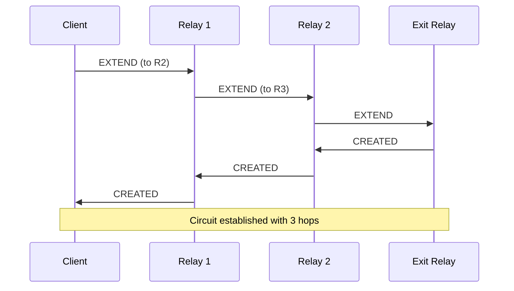
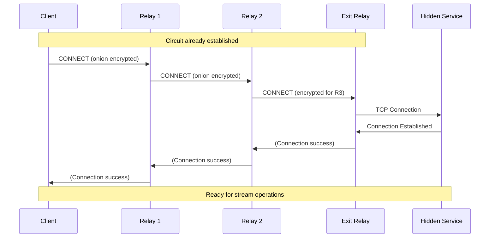
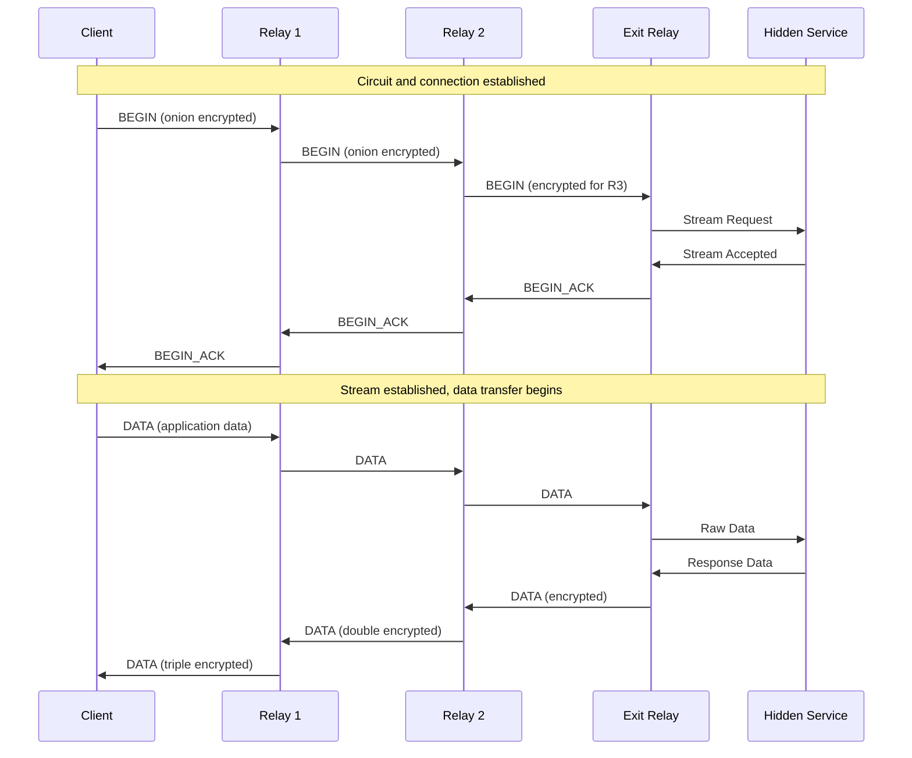
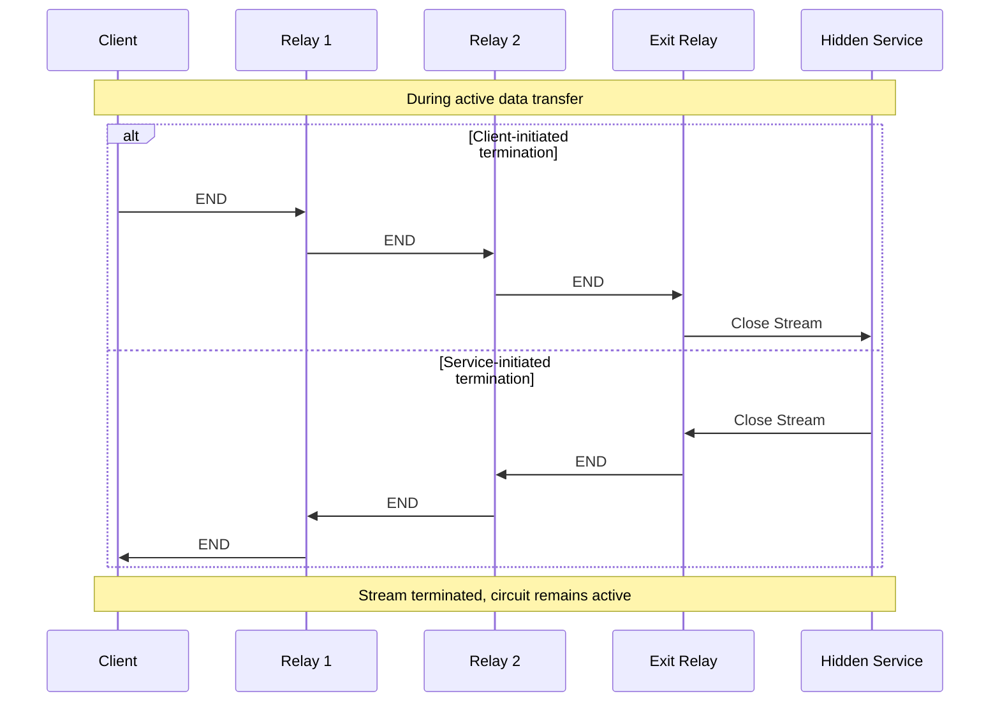
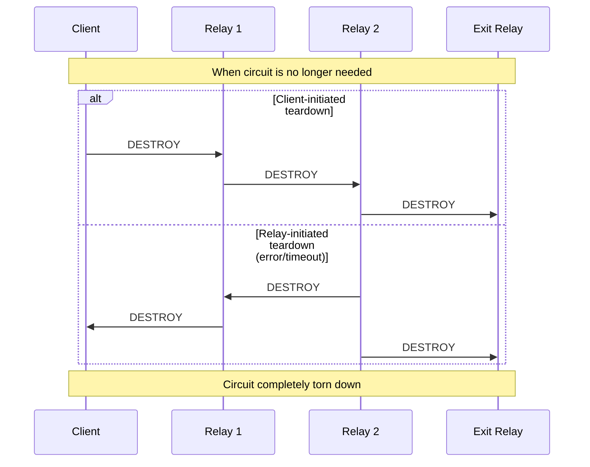

# go-ptor

This repository demonstrates a Domain-Driven Design (DDD) Go project implementing an educational onion routing network. Code is organized following clean architecture principles with proper separation of concerns:

```
shared/                   # Common domain and technical services
  domain/                # Core domain models (Entity, ValueObject, Repository, Aggregate)
  service/               # Technical services (CryptoService, CellReaderService, etc.)

cmd/client/              # SOCKS5 proxy client service
  usecase/               # Client business logic (circuit building, stream management)
  infrastructure/        # Client-specific infrastructure
  handler/               # SOCKS5 controller

cmd/relay/               # Onion routing relay service
  usecase/               # Relay business logic (cell processing)
  infrastructure/        # Relay-specific infrastructure

cmd/directory/           # HTTP-based directory service
cmd/hidden/              # Hidden service TCP proxy
cmd/httpdemo/            # Demo HTTP server
cmd/keygen/              # Key generation utility
```

The architecture separates:
- **Domain logic** (shared across services)
- **Technical services** (shared implementations like crypto)
- **Business logic** (service-specific usecases)
- **Infrastructure** (service-specific external dependencies)

## Requirements

- Go **1.24** or higher (see `mise.toml`)

## Setup

1. Install Go and ensure `go` is in your `PATH`.
2. Clone this repository and download dependencies:

   ```bash
   go mod download
   ```

## Development

This project uses [Lefthook](https://github.com/evilmartians/lefthook) to run
formatting and tests automatically. After cloning, install Lefthook and set up
the Git hooks:

```bash
go install github.com/evilmartians/lefthook@latest
lefthook install
```

The pre-commit hook formats staged Go files with `gofmt`, and the pre-push hook
runs `go test ./...`.

## Cell Commands and Protocol Flow

This implementation uses 8 different cell commands to manage circuit building, stream establishment, and data transfer across the onion routing network.

### Cell Command Types

| Command | Value | Purpose | Direction |
|---------|-------|---------|-----------|
| `EXTEND` | 0x01 | Circuit extension request | Client → Relay |
| `CONNECT` | 0x02 | Hidden service connection | Client → Exit Relay |
| `DATA` | 0x03 | Application data transfer | Bidirectional |
| `END` | 0x04 | Stream termination | Bidirectional |
| `DESTROY` | 0x05 | Circuit teardown | Bidirectional |
| `BEGIN` | 0x06 | Stream initiation | Client → Exit Relay |
| `BEGIN_ACK` | 0x07 | Stream acknowledgment | Exit Relay → Client |
| `CREATED` | 0x08 | Circuit extension response | Relay → Client |

### Protocol Sequence Diagrams

#### 1. Circuit Building Flow



#### 2. Hidden Service Connection Flow



#### 3. Stream Establishment and Data Transfer



#### 4. Stream Termination Flow



#### 5. Circuit Teardown Flow



### UseCase Architecture

The implementation separates these commands into focused UseCases:

**Client UseCases:**
- `BuildCircuitUseCase` - Handles circuit building with EXTEND/CREATED commands
- `SendConnectUseCase` - Manages CONNECT commands for hidden services
- `OpenStreamUseCase` - Initiates streams with BEGIN commands
- `SendDataUseCase` - Transfers application data with DATA/BEGIN commands
- `CloseStreamUseCase` - Terminates streams with END commands

**Relay UseCases:**
- `HandleExtendUseCase` - Processes EXTEND commands and responds with CREATED
- `HandleConnectUseCase` - Establishes connections to hidden services
- `HandleBeginUseCase` - Handles stream initialization and sends BEGIN_ACK
- `HandleDataUseCase` - Forwards DATA between circuit hops and external connections
- `HandleEndStreamUseCase` - Processes stream termination
- `HandleDestroyUseCase` - Handles circuit teardown

## Usage

Each entry in `cmd/` is a standalone binary. You can run them directly with `go run` or build them using `go build`.
For example, to start the client:

```bash
go run ./cmd/client
```

When the client resolves a `.ptor` address, it consults the directory to find
the designated exit relay for that service. A new circuit is built so this relay
is the final hop. The client then sends a CONNECT cell once for that circuit
before any streams are opened. After the CONNECT succeeds, stream data continues
to use BEGIN cells as before. The CONNECT payload is onion encrypted across all
hops so only the exit relay can read it.

### Environment variables

The relay uses the `PTOR_HIDDEN_ADDR` variable to locate the hidden HTTP service
when processing CONNECT cells. If not set, it falls back to `hidden:5000` (the
Docker demo value). The older `HIDDEN_ADDR` variable is also checked for
backward compatibility.

Relay connections are kept in an in-memory table. The TTL can be configured
with the `-ttl` flag when starting the relay. Increase this value when
troubleshooting long-lived circuits. A default TTL can also be provided via the
`PTOR_TTL_SECONDS` environment variable which specifies the number of seconds
to keep each circuit entry.

Additional logging now records failures when decoding EXTEND payloads,
connecting to next hops, or forwarding cells so issues can be diagnosed more
easily.

### Hidden service

The hidden service proxies incoming connections to an upstream HTTP server. Use
the `-http` flag to specify the target address.

The provided `docker compose` configuration starts a small demo server from
`cmd/httpdemo` and points the hidden service at `httpdemo:8080`. Bring up the
demo stack with:

```bash
docker compose up --build
```

The hidden service will print its `.ptor` address on startup. You can access it
via the client once the stack is running.

## Testing

Execute all unit tests with:

```bash
go test ./...
```

## TODO: Tor Protocol Compatibility

This implementation is currently an educational demonstration of onion routing concepts and is **completely incompatible** with the actual Tor network. The following changes would be needed to achieve Tor protocol compatibility:

### Phase 1: Core Protocol Compatibility (High Priority)

#### 1. Cell Structure Redesign
- [ ] **Replace custom cell format with standard 512-byte fixed cells**
  - Current: Custom `Cmd|Version|Length|Payload|Padding` format
  - Target: Fixed 512-byte cells with proper Tor cell structure
  - Files: `internal/domain/value_object/cell.go`, `internal/handler/`

#### 2. RELAY Cell Implementation
- [ ] **Wrap all relay commands (BEGIN/DATA/END) in RELAY cells**
  - Current: Direct command processing in relays
  - Target: All application-level commands wrapped in RELAY cells
  - Impact: Complete relay processing logic rewrite
  - Files: `internal/usecase/relay_usecase.go`, `internal/usecase/send_data_usecase.go`

#### 3. Encryption Algorithm Migration
- [ ] **Replace AES-256-GCM with AES-128-CTR**
  - Current: AES-GCM with custom nonce management
  - Target: AES-CTR as per Tor specification
  - Files: `internal/infrastructure/service/crypto_service.go`
  - Impact: Complete cryptographic rewrite, key derivation changes

#### 4. Remove Custom CONNECT Command
- [ ] **Eliminate CmdConnect and use standard RELAY_BEGIN**
  - Current: Custom CONNECT command for hidden services
  - Target: Standard Tor RELAY_BEGIN command only
  - Files: `internal/usecase/connect_usecase.go`, `internal/usecase/relay_usecase.go`
  - Impact: Hidden service connection logic rewrite

### Phase 2: Protocol Adherence (Medium Priority)

#### 5. Circuit Building Protocol
- [ ] **Implement TAP/ntor handshake protocols**
  - Current: X25519 ECDH + HKDF
  - Target: Standard Tor TAP or ntor protocol
  - Files: `internal/usecase/service/circuit_build_service.go`
  - Impact: Complete circuit establishment rewrite

#### 6. Flow Control Implementation
- [ ] **Add SENDME cells for congestion control**
  - Current: No flow control mechanism
  - Target: SENDME-based flow control per Tor spec
  - Files: New files needed, relay processing updates

#### 7. Standard Tor Commands
- [ ] **Implement missing Tor commands**
  - Add: PADDING, RELAY_EARLY, CREATE_FAST, CREATED_FAST
  - Add: VERSIONS, NETINFO, RELAY_COMMAND_* variants
  - Files: `internal/domain/value_object/cell.go`, relay processing

#### 8. Proper Relay Forwarding
- [ ] **Complete upstream encryption implementation** ⚠️ IN PROGRESS
  - Current: Single-layer encryption (exit relay only) - NOT Tor-compliant
  - Target: Multi-layer encryption with proper nonce synchronization
  - Critical issues:
    - Nonce synchronization between upstream/downstream flows
    - Independent nonce counters for upstream encryption
    - Proper layer-by-layer encryption addition in middle relays
    - Client multi-layer decryption with correct nonce sequence
  - Files: `internal/usecase/relay_usecase.go`, `cmd/client/main.go`
  - Sub-tasks:
    - [ ] Design upstream-specific nonce management system
    - [ ] Implement upstream encryption in middle relays
    - [ ] Fix client multi-layer decryption for upstream data
    - [ ] Add comprehensive testing for nonce synchronization
    - [ ] Validate against Tor protocol compliance
- [ ] **Fix downstream relay processing to maintain end-to-end encryption**
  - Current: Middle relays decrypt application data for downstream
  - Target: Layer-by-layer onion peeling only
  - Files: `internal/usecase/relay_usecase.go`
  - Impact: Fundamental relay processing changes

### Phase 3: Complete Tor Compatibility (Lower Priority)

#### 9. Directory System Overhaul
- [ ] **Replace HTTP directory with Tor directory protocol**
  - Current: Centralized HTTP-based directory service
  - Target: Distributed directory authorities with consensus
  - Files: Complete directory service rewrite
  - Impact: New consensus protocol, descriptor parsing

#### 10. Hidden Service Protocol v3
- [ ] **Implement proper hidden service protocol**
  - Current: Custom .ptor addresses with direct connections
  - Target: .onion v3 addresses with introduction/rendezvous points
  - Files: Complete hidden service rewrite
  - Impact: Introduction points, rendezvous protocol, descriptor publication

#### 11. Guard Relay System
- [ ] **Add entry guard selection and management**
  - Current: Random relay selection per circuit
  - Target: Persistent guard relay selection
  - Files: New guard management system
  - Impact: Client-side guard relay logic

#### 12. Advanced Features
- [ ] **Bandwidth measurement and weighted relay selection**
- [ ] **Proper circuit multiplexing and load balancing**
- [ ] **Bridge support for censorship circumvention**
- [ ] **Pluggable transports interface**

### Technical Debt and Code Quality

#### 13. Architecture Improvements
- [ ] **Add comprehensive error handling and recovery**
- [ ] **Implement proper logging with log levels**
- [ ] **Add configuration management system**
- [ ] **Performance optimization for cell processing**

#### 14. Testing and Validation
- [ ] **Add Tor protocol compliance tests**
- [ ] **Implement integration tests with real Tor clients**
- [ ] **Add performance benchmarks**
- [ ] **Security audit and vulnerability assessment**

### Current Status

**⚠️ Warning**: This implementation is for educational purposes only and should never be used for actual anonymity or privacy protection. Key differences from Tor:

- **Incompatible cell format**: Custom commands and structure
- **Wrong encryption**: AES-GCM instead of AES-CTR
- **Missing RELAY cells**: Direct command processing breaks onion routing
- **Custom hidden services**: .ptor addresses instead of .onion
- **No flow control**: Missing SENDME mechanism
- **Centralized directory**: HTTP-based instead of consensus
- **Simplified handshakes**: X25519 instead of TAP/ntor

### Contributing

When working on Tor compatibility, please:
1. Reference the [Tor Protocol Specification](https://spec.torproject.org/)
2. Test changes against the official Tor implementation
3. Maintain backward compatibility for educational demos
4. Update this TODO list as items are completed

For questions about Tor protocol details, consult:
- [Tor Specification](https://spec.torproject.org/)
- [Tor Research](https://research.torproject.org/)
- [Tor Source Code](https://gitlab.torproject.org/tpo/core/tor)
